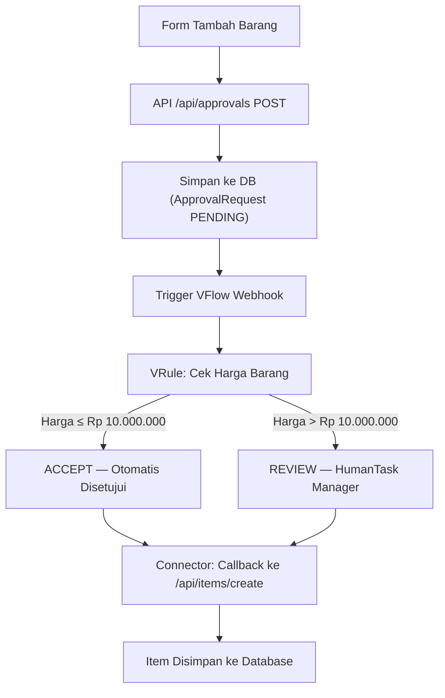
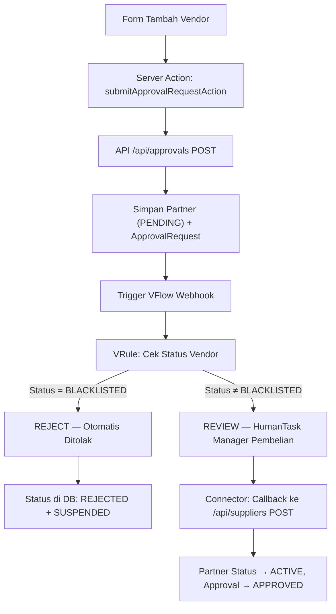
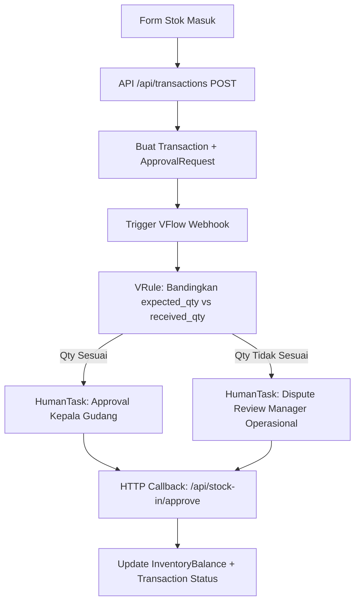
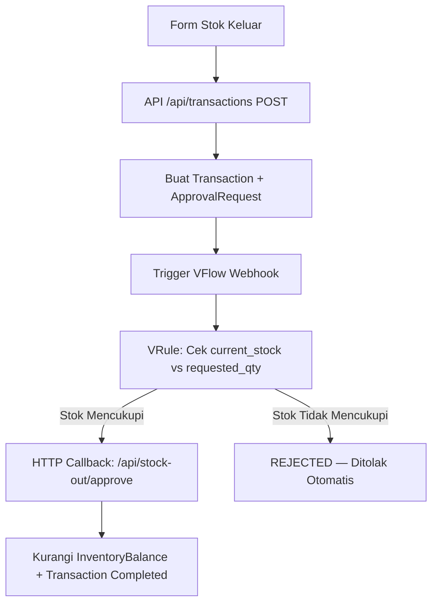
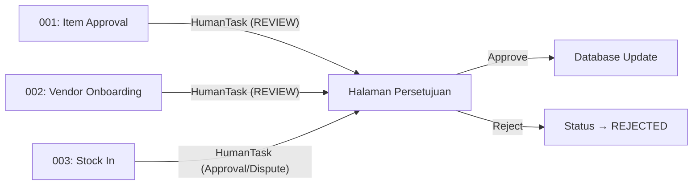

# 📦 Sistem Manajemen Inventory — Next.js + VFlow

<div align="center">

**Aplikasi manajemen inventaris berbasis web yang terintegrasi dengan VFlow Workflow Engine untuk otomasi proses bisnis.**

Dibangun menggunakan **Next.js 16** · **Prisma ORM** · **PostgreSQL** · **VFlow SQA Runtime** · **VRule Decision Engine**

</div>

---

## 📋 Daftar Isi

- [📦 Sistem Manajemen Inventory — Next.js + VFlow](#-sistem-manajemen-inventory--nextjs--vflow)
  - [📋 Daftar Isi](#-daftar-isi)
  - [🌐 Gambaran Umum](#-gambaran-umum)
  - [🏗 Arsitektur Sistem](#-arsitektur-sistem)
  - [🚀 Fitur Utama](#-fitur-utama)
    - [1. 📦 Manajemen Produk — Halaman Produk](#1--manajemen-produk--halaman-produk)
      - [Alur Workflow (001 — Item Approval)](#alur-workflow-001--item-approval)
    - [2. 🏭 Manajemen Supplier — Halaman Supplier](#2--manajemen-supplier--halaman-supplier)
      - [Alur Workflow (002 — Vendor Onboarding)](#alur-workflow-002--vendor-onboarding)
    - [3. 📄 Transaksi Inventaris — Halaman Faktur](#3--transaksi-inventaris--halaman-faktur)
      - [Alur Workflow (003 — Stock In)](#alur-workflow-003--stock-in)
      - [Alur Workflow (004 — Stock Out)](#alur-workflow-004--stock-out)
    - [4. ✅ Pusat Persetujuan — Halaman Persetujuan](#4--pusat-persetujuan--halaman-persetujuan)
      - [Hubungan dengan Workflow Lain](#hubungan-dengan-workflow-lain)
  - [🛠 Cara Menjalankan Proyek](#-cara-menjalankan-proyek)
    - [Prasyarat](#prasyarat)
    - [Langkah-langkah](#langkah-langkah)
      - [1. Clone Repository](#1-clone-repository)
      - [2. Salin dan Konfigurasi Environment Variables](#2-salin-dan-konfigurasi-environment-variables)
      - [3. Install Dependencies](#3-install-dependencies)
      - [4. Generate Prisma Client](#4-generate-prisma-client)
      - [5. Jalankan Migrasi Database](#5-jalankan-migrasi-database)
      - [6. (Opsional) Seed Data Awal](#6-opsional-seed-data-awal)
      - [7. Jalankan dengan Docker Compose (Rekomendasi)](#7-jalankan-dengan-docker-compose-rekomendasi)
      - [8. Atau Jalankan Tanpa Docker (Manual)](#8-atau-jalankan-tanpa-docker-manual)
      - [9. Provisioning Workflow VFlow](#9-provisioning-workflow-vflow)
  - [▲ Panduan Deployment ke Vercel](#-panduan-deployment-ke-vercel)
  - [🔑 Variabel Lingkungan (Environment)](#-variabel-lingkungan-environment)
  - [🧰 Tech Stack](#-tech-stack)
  - [📁 Struktur Proyek](#-struktur-proyek)

---

## 🌐 Gambaran Umum

Sistem Manajemen Inventory ini adalah aplikasi web full-stack yang mengelola siklus lengkap inventaris mulai dari pendaftaran produk, onboarding vendor/supplier, transaksi stok masuk & keluar, hingga proses persetujuan bertingkat. Aplikasi ini terintegrasi dengan **VFlow Workflow Engine** dan **VRule Decision Engine** untuk mengotomasi keputusan bisnis melalui 4 workflow utama:

| Workflow | ID | Deskripsi |
|---|---|---|
| `001-item-approval` | Item Approval | Persetujuan barang baru (otomatis/manual berdasarkan harga) |
| `002-vendor-onboarding` | Vendor Onboarding | Onboarding vendor baru (blacklist otomatis ditolak) |
| `003-stock-in` | Stock In | Penerimaan barang dengan validasi quantity & dispute handling |
| `004-stock-out` | Stock Out | Pengeluaran barang dengan validasi stok tersedia |

---

## 🏗 Arsitektur Sistem

```
┌─────────────────────┐       Webhook        ┌─────────────────────┐
│   Next.js App       │ ──────────────────▶   │   VFlow SQA Runtime │
│   (Frontend + API)  │                       │   (Workflow Engine)  │
│                     │ ◀──────────────────   │                     │
│   • Halaman UI      │    HTTP Callback      │   • VRule Engine    │
│   • API Routes      │                       │   • HumanTask       │
│   • Server Actions  │                       │   • Connectors      │
└────────┬────────────┘                       └─────────────────────┘
         │
         │ Prisma ORM
         ▼
┌─────────────────────┐
│   PostgreSQL        │
│   (Database)        │
│                     │
│   • Items           │
│   • Partners        │
│   • Transactions    │
│   • ApprovalRequest │
│   • InventoryBalance│
└─────────────────────┘
```

---

## 🚀 Fitur Utama

### 1. 📦 Manajemen Produk — Halaman Produk

<!-- TODO: Ganti placeholder di bawah dengan screenshot halaman Produk -->
> 📸 **Screenshot:** `[Placeholder — Tambahkan screenshot halaman Produk di sini]`

**Halaman:** `/dashboard/products`
**Workflow VFlow:** `001-item-approval`
**VRule:** `kelompok2_item_rules_v1.vdicl`

Halaman Produk menampilkan ringkasan inventaris secara real-time dengan data langsung dari database PostgreSQL. Fitur ini mencakup:

- **Dashboard KPI** — Menampilkan metrik utama (total produk, penjualan, traffic toko).
- **Tabel Inventaris** — Menampilkan semua barang dari database dengan status stok (Tersedia, Stok Menipis, Habis) yang dihitung otomatis dari `InventoryBalance`.
- **Tambah Barang Baru** — Form untuk mengajukan barang baru yang terhubung ke VFlow.

#### Alur Workflow (001 — Item Approval)



**Aturan VRule:**
| Kondisi | Keputusan | Aksi |
|---|---|---|
| `item_price ≤ 10.000.000` | `ACCEPT` | Barang langsung ditulis ke database |
| `item_price > 10.000.000` | `REVIEW` | Dikirim ke HumanTask untuk approval Manager Operasional |

**API Route yang Terlibat:**
- `POST /api/approvals` — Menyimpan request & trigger VFlow webhook
- `POST /api/items/create` — Callback dari VFlow untuk menyimpan item ke database

---

### 2. 🏭 Manajemen Supplier — Halaman Supplier

<!-- TODO: Ganti placeholder di bawah dengan screenshot halaman Supplier -->
> 📸 **Screenshot:** `[Placeholder — Tambahkan screenshot halaman Supplier di sini]`

**Halaman:** `/dashboard/suppliers`
**Workflow VFlow:** `002-vendor-onboarding`
**VRule:** `kelompok2_vendor_rules_v1.vdicl`

Halaman Supplier mengelola data vendor/supplier dengan fitur lengkap CRUD dan onboarding otomatis melalui VFlow:

- **Tabel Vendor** — Menampilkan daftar vendor dari database dengan kolom nama, kategori, kontak, produk, status (Aktif/Nonaktif/Menunggu/Ditangguhkan), rating, dan tanggal bergabung.
- **Pencarian & Filter** — Filter berdasarkan kategori dan status vendor.
- **Tambah Vendor Baru** — Dialog form untuk mengajukan vendor baru ke VFlow, termasuk opsi uji coba VRule (status Blacklist).
- **Edit & Nonaktifkan Vendor** — Aksi inline dari dropdown menu per baris.

#### Alur Workflow (002 — Vendor Onboarding)



**Aturan VRule:**
| Kondisi | Keputusan | Aksi |
|---|---|---|
| `vendor_status == "BLACKLISTED"` | `REJECT` | Vendor ditolak otomatis, status → SUSPENDED |
| `vendor_status != "BLACKLISTED"` | `REVIEW` | Masuk antrian approval Manager Pembelian |

**API Route yang Terlibat:**
- `POST /api/approvals` — Simpan partner (PENDING) + trigger VFlow
- `POST /api/suppliers` — Callback VFlow untuk mengaktifkan supplier (ACTIVE)
- `PATCH /api/suppliers` — Edit data vendor
- `DELETE /api/suppliers?id=...` — Nonaktifkan vendor (status → INACTIVE)

---

### 3. 📄 Transaksi Inventaris — Halaman Faktur

<!-- TODO: Ganti placeholder di bawah dengan screenshot halaman Faktur -->
> 📸 **Screenshot:** `[Placeholder — Tambahkan screenshot halaman Faktur di sini]`

**Halaman:** `/dashboard/invoice`
**Workflow VFlow:** `003-stock-in` dan `004-stock-out`
**VRule:** `kelompok2_stock_in_rules_v1.vdicl` & `kelompok2_stock_out_rules_v1.vdicl`

Halaman Faktur adalah form transaksi inventaris yang mendukung dua jenis operasi:

- **Stok Masuk (Stock In)** — Penerimaan barang dari supplier. User dapat menambah item secara manual dengan drag-and-drop reorder.
- **Stok Keluar (Stock Out)** — Pengeluaran barang ke pelanggan. User memilih item dari inventaris yang tersedia (dengan validasi stok per lokasi).
- **Pratinjau Faktur** — Preview dokumen faktur real-time dalam format cetak dengan detail lengkap (Dari, Kepada, daftar barang, pajak, diskon, total).
- **Pilih Mitra & Lokasi** — Dropdown partner (vendor/klien) dan lokasi penyimpanan dari database.
- **Penyesuaian** — Konfigurasi pajak (GST/VAT/Pajak Layanan) dan diskon (tetap/persen).

#### Alur Workflow (003 — Stock In)



**Aturan VRule Stock-In:**
| Kondisi | Keputusan | Aksi |
|---|---|---|
| `received_qty == expected_qty` | `APPROVED` | Masuk approval normal Kepala Gudang |
| `received_qty != expected_qty` | `DISPUTE` | Eskalasi ke Manager Operasional untuk review selisih |

#### Alur Workflow (004 — Stock Out)



**Aturan VRule Stock-Out:**
| Kondisi | Keputusan | Aksi |
|---|---|---|
| `requested_qty ≤ current_stock` | `APPROVED` | Langsung diproses, stok dikurangi |
| `requested_qty > current_stock` | `REJECTED` | Ditolak otomatis karena stok tidak mencukupi |

**API Route yang Terlibat:**
- `POST /api/transactions` — Buat transaksi & trigger VFlow webhook
- `POST /api/stock-in/approve` — Callback VFlow: update saldo inventaris (tambah stok)
- `POST /api/stock-out/approve` — Callback VFlow: update saldo inventaris (kurangi stok)

---

### 4. ✅ Pusat Persetujuan — Halaman Persetujuan

<!-- TODO: Ganti placeholder di bawah dengan screenshot halaman Persetujuan -->
> 📸 **Screenshot:** `[Placeholder — Tambahkan screenshot halaman Persetujuan di sini]`

**Halaman:** `/dashboard/approvals`

Halaman Persetujuan adalah pusat kendali untuk semua request yang membutuhkan tindakan manual. Halaman ini menampilkan semua `ApprovalRequest` dengan status **PENDING** dari database:

- **Daftar Approval** — Menampilkan semua request pending (Barang Baru, Vendor Baru, Stok Masuk, Stok Keluar) dengan detail payload.
- **Aksi Setuju/Tolak** — Tombol untuk menyetujui atau menolak request.
  - **Setuju** → Memanggil `POST /api/approvals/approve` yang melakukan upsert data ke database (item/partner/transaction) dan mengirim sinyal ke VFlow.
  - **Tolak** → Memanggil `POST /api/approvals/reject` yang mengubah status menjadi REJECTED.
- **Sinkronisasi VFlow** — API `POST /api/approvals/sync-task` memungkinkan VFlow mengirim update status HumanTask kembali ke Next.js.

#### Hubungan dengan Workflow Lain



**API Route yang Terlibat:**
- `GET /api/approvals?status=PENDING` — Ambil daftar request pending
- `POST /api/approvals/approve` — Setujui request dan upsert ke database
- `POST /api/approvals/reject` — Tolak request
- `POST /api/approvals/sync-task` — Sinkronisasi HumanTask dari VFlow

---

## 🛠 Cara Menjalankan Proyek

### Prasyarat

- **Node.js** ≥ 18
- **Docker** dan **Docker Compose**
- **Akun Ngrok** (untuk tunnel development agar VFlow bisa callback ke localhost)
- **Akses VFlow SQA Runtime** (untuk menjalankan workflow)

### Langkah-langkah

#### 1. Clone Repository

```bash
git clone https://github.com/ridzz4011/Sistem-Manajemen-Inventory-NextJS.git
cd Sistem-Manajemen-Inventory-NextJS
```

#### 2. Salin dan Konfigurasi Environment Variables

```bash
cp .env.example .env
```

Edit file `.env` dan isi semua nilai yang diperlukan (lihat bagian [Variabel Lingkungan](#-variabel-lingkungan-environment)).

#### 3. Install Dependencies

```bash
npm install
```

#### 4. Generate Prisma Client

```bash
npx prisma generate
```

#### 5. Jalankan Migrasi Database

```bash
npx prisma migrate deploy
```

#### 6. (Opsional) Seed Data Awal

```bash
# Jika tersedia script seed
npx prisma db seed
```

#### 7. Jalankan dengan Docker Compose (Rekomendasi)

```bash
npm run docker:compose:dev
```

Perintah ini akan:
- Membangun dan menjalankan container **Next.js** di port `3000`
- Menjalankan **Ngrok** tunnel di port `4040` (dashboard Ngrok)
- Membaca semua variabel dari file `.env`

> 💡 **Tips:** Buka `http://localhost:4040` untuk melihat URL publik ngrok, lalu update `NEXT_PUBLIC_APP_URL` di `.env` dengan URL tersebut.

#### 8. Atau Jalankan Tanpa Docker (Manual)

```bash
npm run dev
```

Buka [http://localhost:3000](http://localhost:3000) di browser.

#### 9. Provisioning Workflow VFlow

Setelah aplikasi berjalan, deploy workflow ke VFlow SQA Runtime:

```bash
node VFlow/scripts/vflow-admin.js provision VFlow/Workflow/001-item-approval/workflow.yaml
node VFlow/scripts/vflow-admin.js provision VFlow/Workflow/002-vendor-onboarding/workflow.yaml
node VFlow/scripts/vflow-admin.js provision VFlow/Workflow/003-stock-in/workflow.yaml
node VFlow/scripts/vflow-admin.js provision VFlow/Workflow/004-stock-out/workflow.yaml
```

---

## 🔑 Variabel Lingkungan (Environment)

Lihat file [`.env.example`](.env.example) untuk daftar lengkap variabel yang diperlukan:

| Variabel | Deskripsi | Wajib |
|---|---|:---:|
| `DATABASE_URL` | URL koneksi PostgreSQL untuk Prisma | ✅ |
| `POSTGRES_DB` | Nama database (untuk Docker) | ✅ |
| `POSTGRES_USER` | Username database (untuk Docker) | ✅ |
| `POSTGRES_PASSWORD` | Password database (untuk Docker) | ✅ |
| `NEXT_PUBLIC_APP_URL` | URL publik aplikasi (ngrok URL) | ✅ |
| `API_SECRET_KEY` | Secret key untuk otentikasi callback VFlow | ✅ |
| `VFLOW_BASE_URL` | Base URL server VFlow SQA Runtime | ✅ |
| `VFLOW_ADMIN_KEY` | Admin key untuk provisioning workflow | ✅ |
| `VFLOW_PACK_SECRET_KEY_B64` | Secret key untuk signing rule packs | ✅ |
| `LOGSTREAM_TOKEN` | Token untuk streaming log VFlow | ⬜ |
| `NGROK_AUTHTOKEN` | Auth token Ngrok (untuk Docker Compose) | ⬜ |

---

## 🧰 Tech Stack

| Layer | Teknologi |
|---|---|
| **Frontend** | Next.js 16, React 19, Tailwind CSS 4, shadcn/ui, Radix UI |
| **Backend** | Next.js API Routes, Server Actions |
| **Database** | PostgreSQL, Prisma ORM 7 |
| **Workflow** | VFlow SQA Runtime (v3.0), VRule Decision Engine (VDICL) |
| **UI Components** | @tanstack/react-table, react-hook-form, dnd-kit, recharts, sonner |
| **Infrastructure** | Docker, Docker Compose, Ngrok |
| **Linting** | Biome, Husky, lint-staged |

---

## 📁 Struktur Proyek

```
Sistem-Manajemen-Inventory-NextJS/
├── prisma/                          # Schema & migrasi database
│   └── schema.prisma
├── src/
│   ├── app/
│   │   ├── api/                     # API Routes (Backend)
│   │   │   ├── approvals/           # CRUD & workflow persetujuan
│   │   │   ├── items/               # Callback VFlow: buat item
│   │   │   ├── suppliers/           # Callback VFlow: aktivasi vendor
│   │   │   ├── transactions/        # Buat transaksi stok
│   │   │   ├── stock-in/            # Callback VFlow: stok masuk
│   │   │   └── stock-out/           # Callback VFlow: stok keluar
│   │   └── (main)/dashboard/        # Halaman UI (Frontend)
│   │       ├── products/            # 📦 Halaman Produk
│   │       ├── suppliers/           # 🏭 Halaman Supplier
│   │       ├── invoice/             # 📄 Halaman Faktur
│   │       └── approvals/           # ✅ Halaman Persetujuan
│   ├── components/ui/               # Komponen UI (shadcn/ui)
│   ├── server/                      # Server-side logic & Prisma client
│   └── generated/prisma/            # Generated Prisma types
├── VFlow/
│   └── Workflow/
│       ├── 001-item-approval/       # Workflow persetujuan barang
│       │   ├── workflow.yaml
│       │   └── rules/               # VRule: aturan harga barang
│       ├── 002-vendor-onboarding/   # Workflow onboarding vendor
│       │   ├── workflow.yaml
│       │   └── rules/               # VRule: aturan blacklist vendor
│       ├── 003-stock-in/            # Workflow penerimaan barang
│       │   ├── workflow.yaml
│       │   └── rules/               # VRule: validasi qty diterima
│       └── 004-stock-out/           # Workflow pengeluaran barang
│           ├── workflow.yaml
│           └── rules/               # VRule: validasi stok tersedia
├── docker-compose.yml               # Docker Compose (development)
├── docker-compose.prod.yml          # Docker Compose (production)
├── Dockerfile                       # Multi-stage Dockerfile
├── .env.example                     # Template variabel lingkungan
└── package.json
```

---

<div align="center">

Dibuat oleh **Kelompok 2** — Proyek Magang Sistem Manajemen Inventory

</div>

- Farid Noer Hakim
- Surya Kamal
